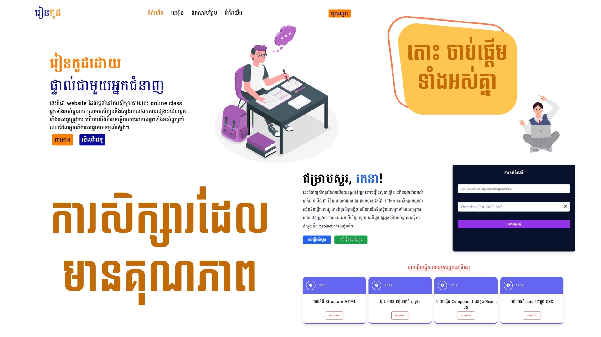

  <h1><a href="https://reancode.netlify.app/">រៀនកូដ</a></h1>
  
នេះគឺជា Final Project Web design​ ដែលខ្ញុំបានសិក្សារនៅឯ SETEC។ អ្នកអាច ចូលមើលហើយ Access នៅ website នេះបាន ។

#
Technology ដែលខ្ញុំបានប្រើប្រាស់នៅ ក្នង website នេះមាន : 
- HTML
- CSS
- JavaScript
- Tailwind (CSS Framework)
#

## Library
- Type.js (text animaion)
- AOS (Animation On Scroll)
- Tailwindcss (CSS Framework)
- Fontawesome (icon)
- Google Font (Font Khmer)